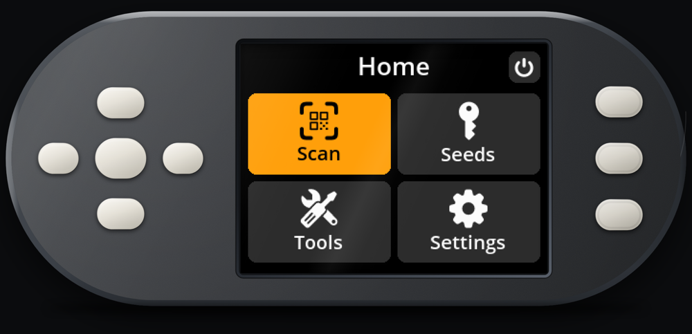

# SeedSigner simulator

[](https://bitsaga.be/seedsigner-simulator/)
[](UPSTREAM)
[](https://github.com/bitsagarob/seedsigner-sim/actions/workflows/reproducible-build.yml)
[](https://github.com/bitsagarob/seedsigner-sim/actions/workflows/test.yml)
[](https://github.com/bitsagarob/seedsigner-sim/actions/workflows/upstream-tests.yml)
[](https://github.com/bitsagarob/seedsigner-sim/releases/latest)
[](LICENSE)

The real [SeedSigner](https://seedsigner.com) firmware — the actual Python from the
device — running in a browser tab. Its screen is a canvas, its buttons are your
keyboard, and its camera is your webcam.

> **This is a simulator, not a wallet.**
> Everything it does happens in a browser tab, on a general-purpose computer, with
> no secure element and no air gap. Treat every key it shows you as public.
> **Never enter a seed phrase you rely on.** Use a public test seed instead: a
> throwaway phrase that holds no bitcoin and never will, published so that people
> have something safe to test with.



A SeedSigner is an open-source Bitcoin signing device you build yourself. This is
the software off one of them, running as a web page: not a video of it, and not a
lookalike rebuilt to resemble it, but the same Python, drawing the same screens
and doing the same work.

That is an easy thing to say and a hard thing to believe, which is why most of
what follows is about making it checkable rather than asking you to take it on
trust. The copy here is tied to one specific published release of the device
software, rather than to whatever happened to be newest. Anyone can rebuild the
file this site serves and get one that is identical, byte for byte — and a machine
now redoes that on every change, on a computer that has never seen the project
before. The behaviour, meanwhile, is checked by the tests the device's own authors
wrote, and not only by tests we wrote ourselves about somebody else's code.

## Try it

```sh
git clone https://github.com/bitsagarob/seedsigner-sim.git
cd seedsigner-sim
./build/fetch-assets.sh              # Pyodide, pinned and hash-checked (~26 MB, once)
./build/build-wallet-zip.sh          # builds wallet.zip from the pinned commit
python3 test/serve.py --port 8770 src/web src/shims build/out
```

Then open <http://127.0.0.1:8770/>.

Neither fetched artefact is committed: Pyodide is 26 MB of someone else's release,
and `wallet.zip` is built rather than shipped so that what you run is provably the
pinned commit and not something a maintainer pasted in. Both steps verify what they
download before using it.

The two headers that server sends are not optional — without cross-origin isolation
the page cannot use `SharedArrayBuffer` and the wallet never starts.
[docs/SELF-HOSTING.md](docs/SELF-HOSTING.md) is the short version. After the first
load the page runs offline.

Arrow keys move, Enter selects, `1` `2` `3` are the three side buttons. You can
also click the buttons on the device.

## What makes it different

- **It is the firmware, not a re-creation.** `wallet.zip` holds the upstream Python
  tree and the wallet's own `Controller.start()` runs it. Menus, seed handling,
  PSBT parsing, QR encoders: all theirs, unmodified.
- **Nothing patches the wallet.** The four places it reaches for hardware are
  replaced from the outside, by the modules in [`src/shims/`](src/shims). That is
  the one claim worth checking rather than believing.
- **Pinned to a release, not a branch tip.** [`UPSTREAM`](UPSTREAM) names the tag
  `SeSi-0.8.7+ShSi-B11` (`662d9dba…`) — the same tag the official pi0-smartcard
  device image is built from, so this and a physical device run the same code. A
  branch tip can be rebased out from under a pin; a tag cannot.
- **You can rebuild it and compare.** `build/build-wallet-zip.sh` reproduces
  `wallet.zip` byte for byte — fixed timestamps, fixed order, no build host in the
  output. If your hash matches the file a page served you, what you ran was the
  pin, its pinned dependencies and this repository's simulated card, and nothing
  else.
- **A machine re-derives that hash on every push**, on a runner that has never seen
  this repository and shares no cache with anything — and GitHub signs the result:
  `gh attestation verify wallet.zip --repo bitsagarob/seedsigner-sim`.
- **Upstream's own tests run against our pinned versions.** CI clones SeedSigner's
  22,000-line suite from the same commit and runs 949 of its tests
  ([`upstream-tests.yml`](.github/workflows/upstream-tests.yml)); nothing is
  vendored and none of it goes near `wallet.zip`. One file of 50 is not collected:
  it is hardware-in-the-loop, wants a physical card reader, and skips itself
  entirely without one.
- **The webcam really is the camera.** Same `DecodeQR`, same SeedQR / CompactSeedQR
  / PSBT / UR parsing the device does. Only the decoder underneath is the
  browser's, because there is no zbar in WebAssembly.
- **Nothing leaves the tab.** The content security policy allows no outbound
  connections and there is no backend to send anything to. Once loaded, it runs
  with the network off.

> If the zip hashes differ but the **contents** hash matches, the two builds hold
> the same files and differ only in compression — some distributions ship zlib-ng.
> That is packaging, not code; `wallet.zip.manifest` lists a sha256 per file.

## What works, and what does not

**Works**

- The full menu tree, seed loading by QR or by hand, passphrases, xpub export,
  PSBT loading and signing, SeedQR backup, settings, every screen that draws a QR.
- Three card slots. Each holds a **SeedKeeper** or a **Satochip** — your choice
  before you insert it, SeedKeeper by default, since that is the card the device
  ships with. Either takes a PIN and checks it.
- **SeedKeeper, end to end:** *Backup seed → To SeedKeeper* puts a seed on the
  card, *Seeds → Load a seed → From SeedKeeper* reads it back off.
- **Satochip:** holds a real BIP32 master key and a real authentikey, and
  pysatochip verifies every answer it signs.

**Does not**

- **"Initialise with Seed" on the Satochip side — upstream's bug, not ours.**
  `ToolsSatochipImportSeedView` unpacks three values from
  `card_bip32_import_seed()`, which returns one, so a *successful* import is what
  raises. Still present on their `dev` tip; nothing here works around it. The card
  is seeded regardless and reading it back works.
- **Copying a secret from one SeedKeeper to another** — an encrypted exchange
  needing a second card to negotiate a session key with. Refused rather than
  quietly done in the clear.
- **Card signing**, PIN change and unblock, 2FA, factory reset and the
  card-management screens: all answer "not supported".
- **Cards that remember.** State is in memory only, so a reload gives factory-fresh
  cards. Deliberate — nothing you do here should outlive the tab.
- **microSD.** No slot to emulate, so settings reset on reload and the firmware
  update flows do not happen.
- **Anything drawn from a background thread.** No threads here: no spinner, no
  scrolling long text, no pulsing warning border. The two animations that carry
  information — camera preview, animated QR — are pumped by hand. Thread-based
  work such as brute-force address verification never completes.
- **Timing-based behaviour.** No wipe timer, no screensaver, no battery readings.
- **Real security properties.** A browser tab is not an air gap, and Pyodide's
  filesystem is not a secure element.

## How it works

The wallet's Python runs under [Pyodide](https://pyodide.org) (CPython compiled to
WebAssembly) inside a Web Worker. Four hardware seams are replaced:

| Seam | Replaced by | Why |
| --- | --- | --- |
| Display | [`src/shims/browser_display.py`](src/shims/browser_display.py) | Swaps the panel driver underneath SeedSigner's own unmodified `Renderer`; raw RGB frames go to a canvas. |
| Buttons | patched in [`src/web/wallet-worker.js`](src/web/wallet-worker.js) | The worker is blocked inside the wallet's main loop and can never answer a `postMessage`, so keys cross on a `SharedArrayBuffer` and wake it with `Atomics`. |
| Camera + QR | [`src/shims/browser_camera.py`](src/shims/browser_camera.py) + [`src/web/wallet-camera.js`](src/web/wallet-camera.js) | pyzbar is a C library with no WebAssembly build, so the browser decodes and hands the bytes to SeedSigner's unmodified decoder. |
| Smartcard | [`src/smartcard/`](src/smartcard) | Browsers have no smartcard API, so simulated SeedKeeper and Satochip cards answer real APDUs and pysatochip runs against them unchanged. |

A fifth module, [`src/shims/browser_qr.py`](src/shims/browser_qr.py), makes the
screens that *display* a QR draw one: their drawing lives in a thread this
environment cannot run.

That single constraint — a worker that is permanently blocked and cannot service a
message — explains most of the architecture, including why keys, camera frames and
the card tray all travel over shared memory.
[docs/ARCHITECTURE.md](docs/ARCHITECTURE.md) is the long version, including the
data flow from webcam to decoded seed and why the browser's `BarcodeDetector` is
deliberately never trusted to produce a payload.

## Self-hosting

Two things trip everyone up, both covered in
[docs/SELF-HOSTING.md](docs/SELF-HOSTING.md):

1. The page **must** be served with `Cross-Origin-Opener-Policy: same-origin` and
   `Cross-Origin-Embedder-Policy: require-corp`. Without them `SharedArrayBuffer`
   does not exist and the wallet never starts.
2. The camera needs a secure context: `https`, or `localhost`. Over plain `http` on
   a LAN address there is simply no camera API to ask.

## Development

[CONTRIBUTING.md](CONTRIBUTING.md) covers running it locally, the tests and the
one rule about comments; [test/README.md](test/README.md) explains what each test
proves. `python3 test/run.py` builds what is missing and runs the lot in a real
browser, including a scan against a fake camera pointed at a blank wall that fails
if the wallet reports any seed at all.

Two things to know before debugging: `?debug=1` turns on tracing of every screen,
thread and keypress (the tests read it, and so should you when something stalls),
and the page must be served with the two isolation headers or nothing starts.

## Licence

MIT — see [LICENSE](LICENSE).

Almost none of the code that runs here was written for this repository: the wallet
is upstream SeedSigner (MIT, Copyright (c) 2021 SeedSigner), the interpreter is
Pyodide, the QR decoder is jsQR, and everything the wallet imports is somebody
else's library. [THIRD-PARTY.md](THIRD-PARTY.md) lists all of it — version,
origin, licence, and how to check each one.

## Credits

- [SeedSigner](https://github.com/SeedSigner/seedsigner) — the device and the
  firmware this runs. All of the interesting parts are theirs.
- [3rdIteration/seedsigner](https://github.com/3rdIteration/seedsigner) — the fork
  this is pinned to, which adds the smartcard support the simulated cards
  answer.
- [Pyodide](https://pyodide.org) and [jsQR](https://github.com/cozmo/jsQR) — the two
  pieces of other people's work that make the browser side possible.

This is an independent project. It is not affiliated with or endorsed by the
SeedSigner project, and running it proves nothing about a real device.
